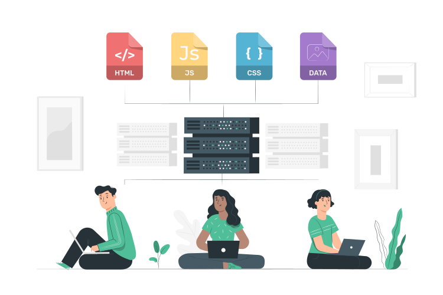

  

<h1 align="center">
  ECHO-PLUS Web Development
</h1>

## 🚀 Quick start

Clone or download the repository to your local computer, 
open one of the two folders (lab or project) via Visual Studio Code. 
and then run the `index.html` root file with the Live Server extension.

## 🧐 What's inside?

- <a href="https://github.com/echoplus/Web-Development/tree/lab">🧪 lab</a>
- <a href="https://github.com/echoplus/Web-Development/tree/project">👨‍🏫 project</a>
- 📷 data

## 🧪 Lab

Here you'll find all the exercises and examples

    .
    ├── 📁 data
    ├──── 📁 fonts
    ├──── 📁 icons
    ├──── 📁 images
    ├── 📁 html
    ├──── 📄 1-heading.html
    ├──── 📄 2-paragraph.html
    ├── 📁 css
    ├──── 📄 1-selectors.css
    ├──── 📄 2-colors.css
    ├── 📁 javascript
    ├── 📁 exercises
    ├── 📄 index.html
    ├── 📄 styles.css
    ├── 📄 rtl.css
    ├── 📄 scripts.js
    └── 💬 README.md

### data

Contains any assets the website needs.  
for example: logo, fonts, images, markdowns, icons, etc.

### html

Contains html files for every topic in HTML.  
for example: heading, paragraph, lists, tables, links, etc.

### css

Contains css files for every topic in CSS.  
for example: selectors, colors, flexbox, grid, etc.

### javascript

Contains js files for every topic in JS with DOM.  
for example: variables, functions, loops, conditions, etc.

### root files

Files located in the root folder like index.html, styles.css, etc.  
They used for global styling, portal page, rtl supports, etc.

## 👨‍🏫 Project

This folder contains all the files related to the project you will need to do.  
followed by the same structure

    .
    ├── 📁 data
    ├──── 📁 fonts
    ├──── 📁 icons
    ├──── 📁 images
    ├── 📁 pages
    ├──── 📄 index.html
    ├──── 📄 blog.html
    ├── 📁 css
    ├──── 📄 base.css
    ├──── 📄 layout.css
    ├── 📄 rtl.css
    ├── 📁 javascript
    ├── 📄 index.html
    └── 💬 README.md
